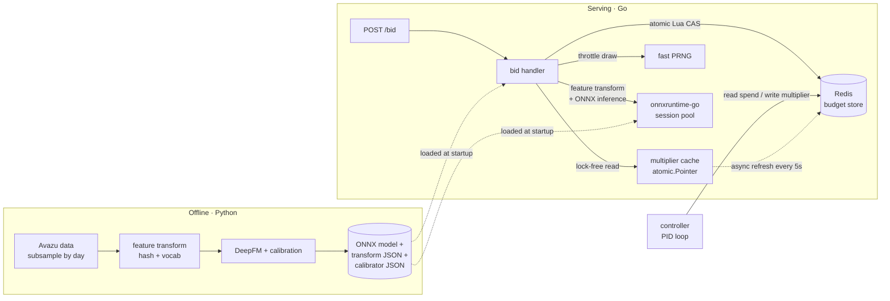

# pacer

A calibrated click-through-rate bidder with PID budget pacing, served on a Go hot
path against a Redis-backed budget store. The whole system exists to compute one
equation, fast and correctly:

```
bid = pCTR × value_per_click × pacing_multiplier
```

- **pCTR** comes from a calibrated DeepFM model (Python/PyTorch → ONNX).
- **value_per_click** is the advertiser's value for a click.
- **pacing_multiplier** comes from a PID controller metering spend against a
  traffic-aware target curve.

Everything in the repo computes one of those three terms or serves the result.

---

## Architecture



The controller and the bid server are **separate binaries**, mirroring real ad
systems where pacing control is decoupled from bid serving.

---

## Results

### CTR model  *(reproduce: `make data && make train`)*

LR is the floor; DeepFM is the model; calibration is the part that matters most
because an uncalibrated pCTR directly scales every bid. Numbers are written to
`python/artifacts/phase2_results.json` and printed by `make train` — they are
**not committed here** because they require the Avazu dataset (Kaggle login). The
table below is the schema the script fills in:

| model  | AUC | logloss | ECE (pre-cal) | ECE (post-cal) |
|--------|-----|---------|---------------|----------------|
| LR     | ~0.74–0.76 (expected) | — | — | n/a |
| DeepFM | ~0.78–0.79 (expected) | — | — | — |

We also report **average predicted CTR vs actual CTR** on test: if the model
over-predicts by even 10%, every campaign over-bids by 10% and burns budget early.
Calibrator (isotonic vs Platt) is chosen by lower validation ECE.

### Pacing strategies  *(reproduce: `make sim`)*

Five strategies, each in smooth and bursty traffic, at identical budgets and seed:

1. `greedy` — ASAP, no pacing (strawman)
2. `uniform_pid_bidshade` — PID on a traffic-**blind** target
3. `traffic_pid_uniform_throttle`
4. `traffic_pid_stratified_throttle` — drops low-pCTR impressions first
5. `traffic_pid_bidshade`

Metrics per run: budget utilization, **mean absolute pacing error (% of budget)**,
L2 spend deviation, **early-exhaustion fraction** (spent ≥99.9% before hour 20),
controller settling time, total clicks, clicks/dollar, effective CPC, daypart
share. Written to `python/artifacts/sim_results.json`.

**Validated controller behavior** (test, no Kaggle needed): a single uncontested
campaign tracks the traffic-aware target to **< 2% mean absolute pacing error**
(`tests/test_baselines.py::test_pid_tracks_target_uncontested`). Under multi-
campaign competition the numbers degrade — see Limitations.

### Serving benchmark  *(reproduce: `make bench`; measured on this machine)*

Apple Silicon, 15 logical CPUs, `GOMAXPROCS=15`, Redis 7 in Docker (local),
onnxruntime session pool, fixture DeepFM. Two paths reported separately because
they have very different cost:

| path | sustained QPS | p50 | p99 | p999 | errors |
|------|--------------:|----:|----:|-----:|-------:|
| **filter-only** (cache lookup + throttle draw) | ~74,400 | 0.61 ms | 1.64 ms | 2.20 ms | 0 |
| **full** (feature transform + ONNX inference + budget charge) | ~33,000 | 1.39 ms | 2.79 ms | 3.57 ms | 0 |

`make profile` captures a CPU profile of the full path. On this hardware the
Go-side CPU is dominated by the **synchronous Redis budget charge (~54%)**, mostly
connection-pool acquisition — which is exactly why batching decrements off the
critical path is the next optimization. Note: ONNX inference runs in the
onnxruntime **C** library via cgo, so a pure-Go CPU profile under-attributes it
(it appears as `cgocall`/`syscall`); read inference cost from the latency delta
between the two paths, not from the Go profile.

### Plots  *(written to `README_assets/` by `make sim` / `make train`)*

- `reliability.png` — reliability diagram, pre vs post calibration
- `spend_curves.png` — spend vs target for a representative campaign, all strategies
- `utilization_dist.png` — budget utilization across all campaigns
- `anti_windup.png` — multiplier response to a traffic trough, anti-windup on/off

---

## Design decisions

**Why traffic-aware targets beat uniform.** Traffic is diurnal. A uniform target
(`budget × t/86400`) forces over-bidding for garbage inventory during the 3am
trough and under-bidding during the 9pm peak. The traffic-aware target spends in
proportion to *expected* traffic estimated from the training days, so pacing lines
up with where the good impressions actually are. Both are implemented; uniform is
a baseline to beat.

**Why calibration matters more than AUC here.** AUC is invariant to any monotone
transform, so a model can rank perfectly and still output useless probabilities.
But `bid = pCTR × value × multiplier` multiplies the probability directly — a
miscalibrated pCTR corrupts every bid and the controller's input. We measure ECE
(equal-mass bins, because pCTR is skewed toward zero) before and after calibration.

**Why the multiplier is cached and stale.** A Redis round trip per bid would cap
throughput. The multiplier table is cached in-process and refreshed asynchronously
every 5s, read lock-free via an `atomic.Pointer`. The hot path reads a slightly
stale multiplier — which is fine, because the controller itself runs on a ~10s
interval, so 5s of staleness is inside the control loop's own resolution.

**Why anti-windup is necessary.** During a traffic trough the controller saturates
its multiplier trying to catch up. Without anti-windup the integral term keeps
accumulating error it can't act on, so when traffic returns the controller stays
pinned at max long after it should have recovered. With conditional-integration
anti-windup it recovers in **1 control tick vs 57** in our demonstration
(`tests/test_windup.py`). This is the single most compelling artifact in the repo.

**Throttle vs bid-shade.** Throttling makes the multiplier a participation
probability: it preserves win-rate-per-participation and gives up volume.
Bid-shading scales the bid: it keeps volume and gives up the top of the auction.
Throttle also composes with **stratified** dropping — shed the lowest-pCTR
impressions first — which delivers more clicks at matched spend because the
objective is value, not smoothness. Use throttle when you don't want to distort
the auction's price signal; use bid-shade when inventory is scarce.

**Budget-normalized control.** The controller operates on error as a *fraction of
budget*, not raw dollars, so the same gains work for a \$10/day and a \$10,000/day
campaign — essential when budgets are log-normal across orders of magnitude.

---

## Limitations

This section makes the rest credible.

- **Intra-hour timestamps are synthetic.** Avazu is hourly. The diurnal *volume
  shape* is real; within each hour we scatter impressions uniformly at random to
  synthesize second-level arrivals. The timestamps are not real.
- **Counterfactual gap in replay-based auction simulation.** We replay logged
  impressions, so the auction winner does not actually change which ad was shown —
  the click label is the label for the originally-shown ad. This is inherent to
  offline ad simulation; we name it rather than hide it.
- **Budgets are sized to greedy-achievable inventory.** To make pacing a real
  problem we set each budget to a fraction of what a campaign could win under
  greedy. Under competitive pacing the achievable set shifts (a shading campaign
  wins less than greedy assumed), so multi-campaign pacing error is larger and
  noisier than the single-campaign case, especially in thin markets. Real data
  (5M impressions) is a much thicker market.
- **Single-machine benchmarks.** QPS/latency are from one laptop with local Redis,
  not a distributed deployment.
- **No real advertiser feedback loop.** value_per_click is sampled, not learned;
  there is no bid-landscape or win-rate feedback.

---

## Reproduce everything

```bash
make venv          # python venv + deps
make data          # download + subsample Avazu (needs Kaggle login)
make train         # train LR + DeepFM, calibrate, export ONNX + transform + calibrator
make sim           # run all strategies x {smooth,bursty}, write tables + plots
make test          # python tests
make redis-up      # start Redis (Docker)
make go-test       # go tests (race), needs Redis for integration/budget tests
make bench         # filter-only vs full path QPS + latency
make profile       # CPU profile of the full path
```

Stack: Python 3.11+ / PyTorch / Polars / ONNX · Go 1.22+ / go-redis /
onnxruntime-go · Redis 7. See `Makefile` for exact commands.
